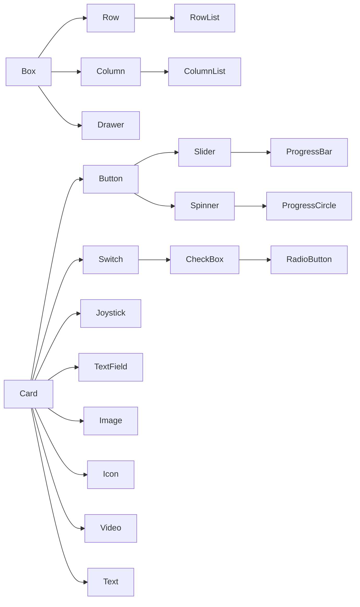

# UI

This is a UI Builder library highly inspired by [Compose](https://www.jetbrains.com/lp/compose-multiplatform/)
It aims to be efficient, flexible and easy-to-use

## Modifier
> TODO

## Layout Prototype
> TODO

Core Elements:
- Box (Container)
- Card (Visual)

Element Inheritance

## Layout
> TODO